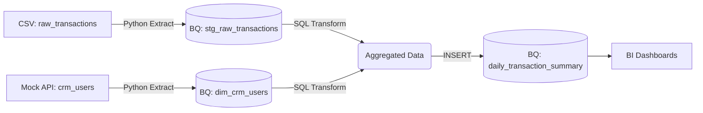

# High-Level Design Document (HLDD)
**Project Name:** Enterprise Data ETL Pipeline
**Author:** Panupong Durongdacha

---

## 1. Project Objective
The goal of this project is to build an automated ETL (Extract, Transform, Load) pipeline using Python to process business transaction data across multiple business domains (e.g., Sales, CRM). This simulates a real-world pipeline that prepares data for downstream BI tools (like Metabase or Tableau), ensuring high data quality and automated reconciliation processes.

## 2. System Architecture Overview
The pipeline follows a modern **ELT (Extract, Load, Transform)** architecture, orchestrated by tools like **Apache Airflow**.



## 3. Data Sources (Extract)
1.  **Transactions File (CSV):** `data/raw_transactions.csv`
    *   **Fields:** `transaction_id`, `user_id`, `amount`, `transaction_type` (Top-up, Payment, Withdrawal), `status` (Completed, Failed, Pending), `timestamp`
    *   **Volume:** Simulated high-volume daily batch.
2.  **CRM User Profiles (Mock API):** 
    *   **Fields:** `user_id`, `user_tier` (Standard, Premium, VIP), `kyc_status`
    *   **Format:** JSON

## 4. Data Transformation Rules (Transform)
The transformation layer is executed in **Google BigQuery using SQL**. The following business logic is applied:
*   **Filtering:** Keep only transactions where `status == 'Completed'`.
*   **Data Integration (Join):** Merge the transaction data with CRM user profiles on `user_id`.
*   **Aggregation:** Summarize the total transaction amount and count, grouped by `date`, `transaction_type`, and `user_tier`.
*   **Idempotency:** Data is partitioned/filtered by `logical_date` to ensure reruns do not duplicate data.

## 5. Target Destination (Load)
Data is loaded into **Google BigQuery**.
*   **Dataset:** `enterprise_data`
*   **Tables:**
    *   `stg_raw_transactions`: Staging table for raw transactions
    *   `dim_crm_users`: Dimension table for CRM profiles
    *   `daily_transaction_summary`: The final aggregated fact table

## 6. Directory Structure
To reflect professional software engineering practices, the project will be structured as follows:

```text
Enterprise_Data_Pipeline_Showcase/
│
├── data/
│   └── raw_transactions.csv        # Mock data for extraction
│
├── sql/
│   └── transform_daily_summary.sql # BigQuery SQL logic
│
├── src/
│   ├── __init__.py
│   ├── extract.py                  # Functions for reading CSV and API
│   ├── transform.py                # (Legacy) Pandas transform reference
│   ├── transform_sql.py            # Executes BigQuery SQL
│   └── load.py                     # Loads raw data to BigQuery
│
├── main_etl.py                     # The main ELT execution script
├── DESIGN.md                       # High-Level Design Document
├── README.md                       # Project documentation
└── requirements.txt                # Python dependencies
```

## 7. Future Enhancements & Scalability
*   **Orchestration:** Convert `main_etl.py` into an Apache Airflow DAG (`dags/etl_dag.py`).
*   **Cloud Functions/Run:** Deploy the extraction and transformation scripts as serverless functions.
*   **Data Quality Checks:** Integrate Great Expectations for automated QA before loading to the data warehouse.
