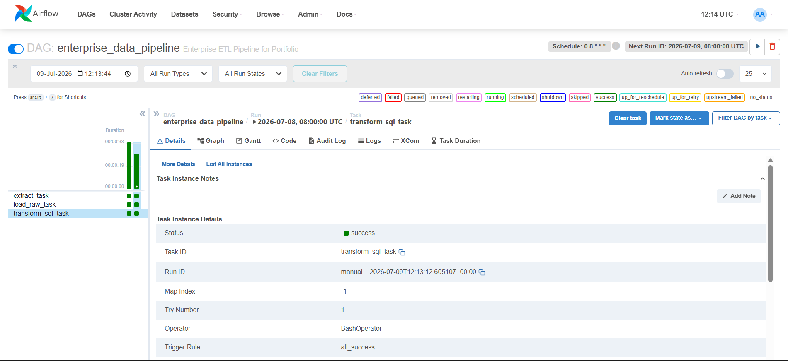
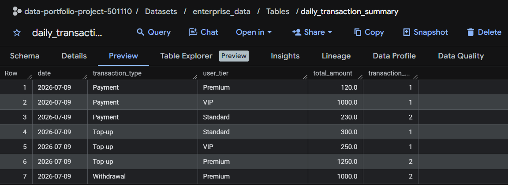

# 🚀 Enterprise ELT Data Pipeline



Welcome to my Python Data Engineering & Automation Hub! This repository demonstrates a production-grade **ELT (Extract, Load, Transform)** pipeline orchestrated by **Apache Airflow** and powered by **Google BigQuery**.

## 🎯 Business Impact & Context
In a modern data-driven organization, data accuracy and timely reporting are critical. This project simulates a daily batch pipeline that:
1. **Extracts** high-volume transaction records (CSV) and user profiles (Mock API) using Python.
2. **Loads** the raw data into Google BigQuery staging tables (`stg_raw_transactions`, `dim_crm_users`).
3. **Transforms** the data natively inside BigQuery using standard SQL, allowing for massive scalability and avoiding local memory bottlenecks (ELT vs ETL).

This automated pipeline is built with **Idempotency** in mind (using Airflow's `logical_date` / `{{ ds }}`), meaning it can be rerun seamlessly for backfilling data without causing data duplication.



---

## 📂 Project Structure & Features

See [DESIGN.md](DESIGN.md) for the complete High-Level Design Document (HLDD) and Architecture Diagrams.

### Tech Stack
- **Languages:** Python 3, Standard SQL
- **Libraries:** `pandas`, `google-cloud-bigquery`
- **Data Warehouse:** Google Cloud BigQuery
- **Orchestration:** Apache Airflow (Dockerized)
- **Transformation (Upcoming):** dbt (data build tool)

### Repository Layout
- `dags/`: Airflow DAG definitions
- `scripts/`: Python ingestion scripts (Mock API and CSV processing)
- `sql/`: BigQuery SQL transformation queries
- `dbt_transform/`: *[WIP]* Planning docs and future dbt integration for advanced transformations
- `config/` & `logs/`: Airflow configurations and execution logsw)

---

## ⚙️ How to Run Locally

### 1. Prerequisites
- Docker & Docker Compose (for Airflow)
- A Google Cloud Project with BigQuery enabled
- A Service Account JSON key (placed in the root directory)

### 2. Setup
Clone this repository and install the dependencies:
```bash
pip install -r requirements.txt
```

### 3. Run via Python CLI
You can execute the pipeline for a specific logical date to simulate how Airflow runs the job:
```bash
# Process data for a specific date (Idempotent run)
python main_etl.py --date 2026-07-09
```

### 4. Run via Airflow UI
1. Start the Airflow cluster:
   ```bash
   docker-compose up -d
   ```
2. Access the UI at `http://localhost:8080` (Username/Password: `airflow`)
3. The DAG `enterprise_data_pipeline` is scheduled to run daily at 08:00 UTC. You can trigger it manually to watch the Extract ➔ Load Raw ➔ Transform SQL process flow in action!

*(Note: If you make changes to the DAG files while developing outside the container, run `sync_dags.bat` to sync them into Airflow).*

---

## 🧠 Key Learnings & Challenges Solved

Building this project involved solving several common Data Engineering challenges:
- **ELT over ETL:** Initially started with Pandas for transformations, but transitioned to BigQuery SQL to shift the compute load to the Cloud Data Warehouse. This avoids out-of-memory (OOM) errors in Airflow workers when data scales.
- **Idempotent Pipelines:** Implemented `DELETE + INSERT` logic utilizing Airflow's `logical_date` (`{{ ds }}`). This ensures the pipeline can be safely re-run for backfilling without duplicating records.
- **Data Integration:** Successfully joined raw event streams (Transactions CSV) with dimension data (CRM API) based on complex business logic (e.g., verifying KYC status).

## 🚀 Future Enhancements

While this pipeline is fully functional, here is what I plan to implement next to make it even more robust:
- **dbt (data build tool):** *Currently in planning phase (see `dbt_transform/Action_Plan.md`).* Will integrate dbt to manage the BigQuery SQL transformations, enabling better lineage tracking, templating, and built-in testing.
- **Data Quality Checks:** Implement `Great Expectations` or Airflow SQL Check Operators to validate data freshness, null constraints, and value distributions before pushing to BI dashboards.
- **CI/CD Pipeline:** Add GitHub Actions to automate DAG testing and deployment to the Airflow server.
- **Cloud Orchestration:** Migrate the local Airflow Docker setup to Google Cloud Composer for a fully managed serverless experience.
